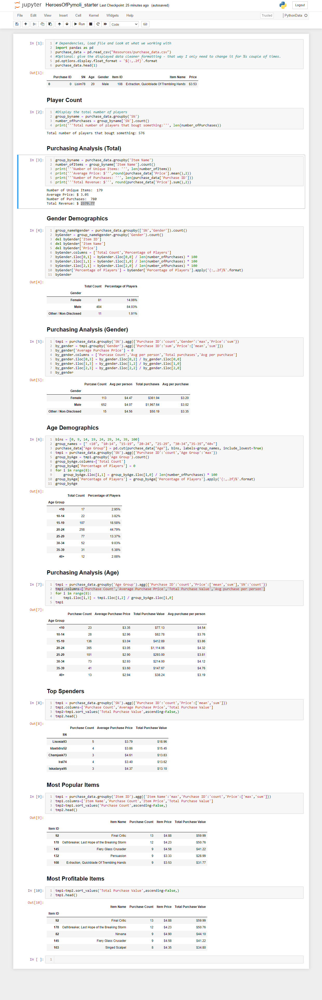

# Pandas - Pandas, Pandas, Pandas

## Included a written description of three observable trends based on the data:

1 - Majority of paying players are male (over 80% - see pt2)

2 - Largest age group is 20-24 year olds (make up almost half of customers - might want to concentrate marketing efforts here)

3 - Top 5 saleable items (IDs: 92 178 82 145 103) make up about 10% of the revenue (might need futher look into some promo on said items)

